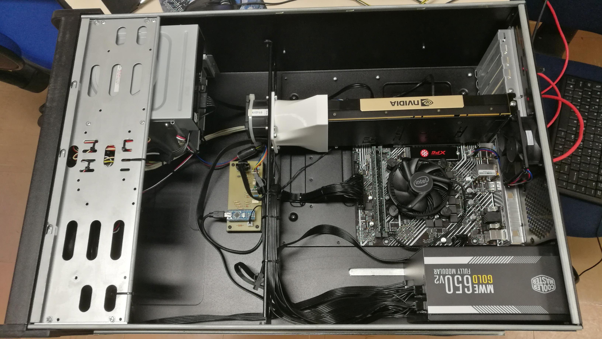
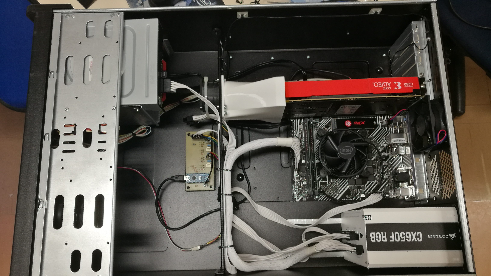

## Open-source active cooling system for GPU and FPGA accelerator cards 

An open-source, Arduino-based, programmable active cooling system for a
GPU NVIDIA Tesla V100 and for a FGPA Xilinx Alveo U280 cards installed
in standard computer cases.

 

### Overview 

Typically, high-performance Graphics Processing Units (GPU) and Field
Programmable Gate Arrays (FPGA) accelerators are high-power demanding
elements, designed to be mounted in specialized racks with intense
forced airflow systems to assure their functioning within proper thermal
limits. We present here an open-source, Arduino-based, programmable
active cooling system for GPU and FPGA cards that allow their
installation in common computer cases. Only standard components and
simple 3D-printed pieces are employed in our design. We built and have
been continuously using this cooling system for a GPU NVIDIA Tesla V100
and an FPGA Xilinx Alveo U280. The setup is inexpensive and has proved
to be flexible and extremely reliable. Furthermore, it can be easily
adapted for any other card or element requiring similar cooling.

For the rationale and overall description of the project, see the
[paper]{.ul}. For the full build instructions, see the [hardware
details]{.ul}. For the Arduino programming and electronics, see the
[controller details]{.ul}.

### License 

The hardware is available under a
[CERN-OHL-S-2.0](https://spdx.org/licenses/CERN-OHL-S-2.0.html) license,
available also [here]{.ul}.

The software is available under an [MIT
license](https://opensource.org/licenses/MIT), available also
[here]{.ul}.

The documentation is available under a [Creative Commons
Attribution-ShareAlike 4.0 International Public License (CC BY-SA
4.0)](https://creativecommons.org/licenses/by-sa/4.0/), available also
[here]{.ul}.

### Contact 

This project was carried out in the Institute of Mathematics,
Statistics, and Scientific Computing of the University of Campinas, SP,
Brazil. For questions, please contact the developer Rodolfo Manin
(<rodolfo@ime.unicamp.br>) or the Principal Investigator Alberto Saa
(<asaa@ime.unicamp.br>).

### Citation 

R. Manin and A. Saa, Open-source active cooling system for GPU and FPGA
accelerator cards (2002).

### Funding 

This research was supported by CNPq (grant 302674/2018-7) and FAPESP
(grant 21/09293-7).

### Dataset Metadata 

The following table is necessary for this dataset to be indexed by
search engines such as [Google Dataset
Search](https://g.co/datasetsearch).

+--------------+------------------------------------------------------+
| **property** | **value**                                            |
+--------------+------------------------------------------------------+
| name         | Open-source active cooling system for GPU and FPGA   |
|              | accelerator cards                                    |
+--------------+------------------------------------------------------+
| description  | We present here an open-source, Arduino-based,       |
|              | programmable active cooling system for GPU and FPGA  |
|              | cards that allow their installation in common        |
|              | computer cases. Only standard components and simple  |
|              | 3D-printed pieces are employed in our design. We     |
|              | built and have been continuously using this cooling  |
|              | system for a GPU NVIDIA Tesla V100 and an FPGA       |
|              | Xilinx Alveo U280. The setup is inexpensive and has  |
|              | proved to be flexible and extremely reliable.        |
|              | Furthermore, it can be easily adapted for any other  |
|              | card or element requiring similar cooling.           |
+--------------+------------------------------------------------------+
| url          | [https]{.ul}://[github]{.                            |
|              | ul}.com/[RodLophus]{.ul}/[ArduinoFanController]{.ul} |
+--------------+------------------------------------------------------+
| sameAs       | [https]{.ul}://[github]{.                            |
|              | ul}.com/[RodLophus]{.ul}/[ArduinoFanController]{.ul} |
+--------------+------------------------------------------------------+
| citation     | R. Manin and A. Saa, Open-source active cooling      |
|              | system for GPU and FPGA accelerator cards (2002).    |
+--------------+------------------------------------------------------+
| hw license   |   ----------                                         |
|              | ---- ----------------------------------------------- |
|              |   **property**   **value**                           |
|              |   name           CERN-OHL-S-2.0                      |
|              |   url                                                |
|              |        https://spdx.org/licenses/CERN-OHL-S-2.0.html |
|              |   ----------                                         |
|              | ---- ----------------------------------------------- |
+--------------+------------------------------------------------------+
| sw license   |                                                      |
|              | -------------- ------------------------------------- |
|              |   **property**   **value**                           |
|              |   name           MIT                                 |
|              |   url            https://opensource.org/licenses/MIT |
|              |                                                      |
|              | -------------- ------------------------------------- |
+--------------+------------------------------------------------------+
| docs license |   ------------                                       |
|              | -- ------------------------------------------------- |
|              |   **property**   **value**                           |
|              |   name           CC BY-SA 4.0                        |
|              |   url                                                |
|              |      https://creativecommons.org/licenses/by-sa/4.0/ |
|              |   ------------                                       |
|              | -- ------------------------------------------------- |
+--------------+------------------------------------------------------+
